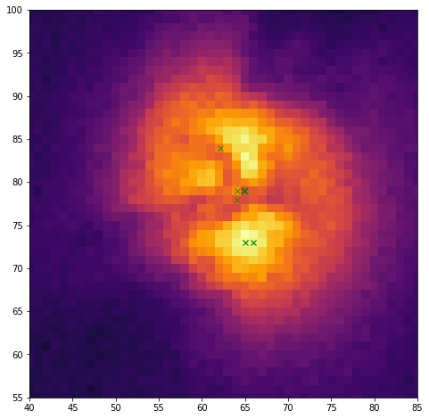
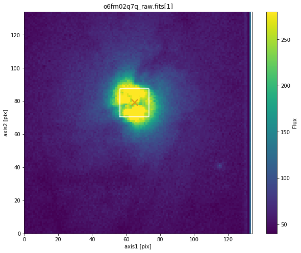

Example Usage: ``checkboxsize`` Stability
-----------------------------------------

.. code:: python

    import stistarg
    
    import numpy as np
    from astropy.io import fits
    import matplotlib
    %matplotlib inline
    from matplotlib import pyplot as plt
    
    # Some plotting parameters:
    matplotlib.rcParams['image.origin'] = 'lower'
    matplotlib.rcParams['image.cmap'] = 'inferno'
    matplotlib.rcParams['image.aspect'] = 'equal'
    matplotlib.rcParams['image.interpolation'] = 'none'
    matplotlib.rcParams['figure.figsize'] = [10, 8]
    
    stistarg.__version__

.. parsed-literal::

    '2.4'

.. code:: python

    filename = 'o6fm02q7q_raw.fits'
    
    # Define checkbox sizes to run the simulator on:
    checkbox_sizes = np.arange(3, 27+1, 2)
    
    # Define empty arrays to populate with results from stistarg:
    x = np.zeros_like(checkbox_sizes, dtype=np.float)
    y = np.zeros_like(checkbox_sizes, dtype=np.float)
    
    # Run stistarg for different checkbox sizes:
    for i, checkbox_size in enumerate(checkbox_sizes):
        simulation = stistarg.stistarg(filename, ext=1, source='diffuse', checkboxsize=checkbox_size)
        x[i], y[i] = simulation['fluxCentroid']
    
    fig, ax = plt.subplots(1, 1)
    ax.imshow(fits.getdata(filename, ext=1))
    ax.plot(x, y, 'gx', alpha=0.8)
    ax.set_xlim(40, 85)
    ax.set_ylim(55, 100)

Plotting the various flux centroid positions found by the simulator:

And now plot these vs `checkboxsize`:

.. code:: python

    fig, axes = plt.subplots(2, 1, sharex=True)
    fig.set_size_inches(10, 7)
    
    axes[0].plot(checkbox_sizes, x, '.-')
    axes[1].plot(checkbox_sizes, y, '.-')
    
    # Some plotting parameters:
    axes[0].set_ylim(61, 75)
    axes[1].set_ylim(71, 85)
    axes[0].set_ylabel('X [pix]')
    axes[1].set_ylabel('Y [pix]')
    axes[1].set_xlabel('Checkbox Size [pix]')
    fig.suptitle(filename.rsplit('_',1)[0].upper())
    [ax.grid(True, alpha=0.2) for ax in axes];

.. image:: _static/output_4_0.png

`stistarg` appears to have found two regimes of stable solutions: a local
knot when the checkbox size is 3-9 pix, and a global solution when ≥15
pix. Two of these are plotted below using the simulator to confirm.

Users are advised to avoid checkbox sizes bordering transitions, as
slight variations in the detected scene count rates could give
unpredictable results. Varying the parameter allows users to determine
stable regimes.

.. code:: python

    stistarg.stistarg(filename, ext=1, source='diffuse', checkboxsize=3, display=True)

The smaller `checkboxsize` found a small bright feature within the galaxy:

.. parsed-literal::

    --------------------------------------------------------------------------------
    STIS Target Acquisition Simulator
    stistarg.py v2.4
    Python v3.6.3
    Run time:  2018-07-27 12:53:29
    
    Input File:      o6fm02q7q_raw.fits[1]
    Input Options:   diffuse source, checkbox size = 3
    Image Subarray:  (129, 134)
    
    Brightest checkbox flux:  3420
    Flux center:              axis1 = 65.0 ; axis2 = 73.0  [Grey X]
    Geometric center:         axis1 = 65.0 ; axis2 = 73.0  [Orange X]
    
    (All coordinates are zero-indexed.)
    --------------------------------------------------------------------------------

The larger `checkboxsize` found the center of the galaxy:

.. code:: python

    stistarg.stistarg(filename, ext=1, source='diffuse', checkboxsize=17, display=True)

.. parsed-literal::

    --------------------------------------------------------------------------------
    STIS Target Acquisition Simulator
    stistarg.py v2.4
    Python v3.6.3
    Run time:  2018-07-27 12:53:31
    
    Input File:      o6fm02q7q_raw.fits[1]
    Input Options:   diffuse source, checkbox size = 17
    Image Subarray:  (129, 134)
    
    Brightest checkbox flux:  83938
    Flux center:              axis1 = 64.9 ; axis2 = 79.0  [Grey X]
    Geometric center:         axis1 = 65.0 ; axis2 = 79.0  [Orange X]
    
    (All coordinates are zero-indexed.)
    --------------------------------------------------------------------------------

