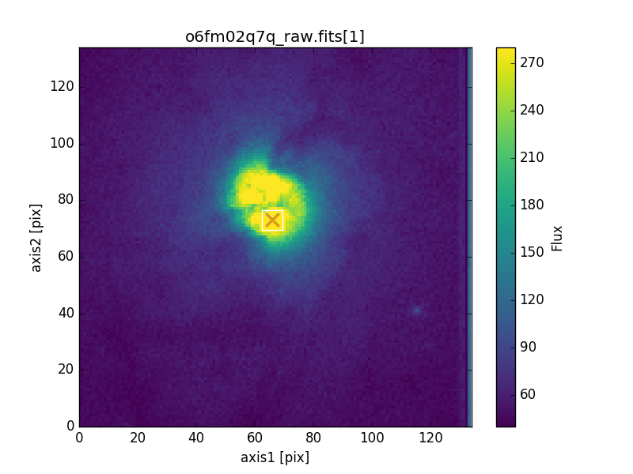

HST/STIS Target Acquisition Simulator
=====================================

Utility to simulate HST/STIS target acquisitions with various "optional parameters" 
available in the Astronomer's Proposal Tool (APT) on a user-supplied FITS image.

.. warning::

  To use input data not derived from STIS acquisition images, some pre-processing is 
  required.  See `Limitations`_ for more details.
  
  Please note that AURA/STScI is not responsible for any damages resulting from the use 
  of this software.

.. toctree::
   :maxdepth: 2

.. code-block:: none

  bash$  stistarg --ext 1 --diffuse 7 --display o6fm02q7q_raw.fits
  --------------------------------------------------------------------------------
  STIS Target Acquisition Simulator
  stistarg.pyc v2.4.1
  Python v3.7.4
  Run time:  2017-01-20 11:39:04
  
  Input File:      o6fm02q7q_raw.fits[1]
  Input Options:   diffuse source, checkbox size = 7
  Image Subarray:  (130, 134)
  
  Brightest checkbox flux:  16653
  Flux center:              axis1 = 66.0 ; axis2 = 73.0  [Grey X]
  Geometric center:         axis1 = 66.0 ; axis2 = 73.0  [Orange X]
  
  (All coordinates are zero-indexed.)
  --------------------------------------------------------------------------------

Installation
------------

The `stistarg` package has been updated to install via pip::

  pip install stistarg

------------------------------------------------------------------------------------------

Alternatively, you may download_ and manually install `stistarg` via::

  python setup.py install

.. _download: https://github.com/spacetelescope/stistarg/archive/master.zip

Note that this package requires `numpy`_, `astropy`_, and `matplotlib`_.

.. _`numpy`: https://numpy.org
.. _`astropy`: https://www.astropy.org
.. _`matplotlib`: https://matplotlib.org

Command Line Interface
----------------------

For more information, type ``stistarg --help``

.. code-block:: none

  usage: stistarg [-h] [--ext EXT] [--point | --diffuse CHECKBOXSIZE] [--display]
                  FILENAME
  
  Simulate HST/STIS onboard target acquisition algorithm on user data.
  
  positional argument:
    FILENAME              Input FITS file
  
  optional arguments:
    -h, --help            show this help message and exit
    --ext EXT             Input FITS extension [default=0]
    --point               Point-source algorithm [default]
    --diffuse CHECKBOXSIZE
                          Diffuse-source algorithm. Specify checkboxsize
                          [odd integer 3-101]
    --display, -d         Display results with matplotlib.pyplot
  
  Written by Berry & Lockwood

Python API
----------

.. autofunction:: stistarg.stistarg

Auxiliary Functions
-------------------

.. autofunction:: stistarg.findcheckbox
.. autofunction:: stistarg.calculate_flux_centroid
.. autofunction:: stistarg.display_results

.. include:: acq_stability.rst

Limitations
-----------

This release currently supports only the STIS detector format and scale.  The 
capability to use non--STIS data will be added in a future release.  Users wishing to 
use data from other sources must trim and rescale their input data accordingly.  The 
STIS CCD plate scale is `0.050725 arcsec/pix`_.

.. _`0.050725 arcsec/pix`: https://hst-docs.stsci.edu/display/STISIHB/14.6+Image+Mode+Geometric+Distortion#id-14.6ImageModeGeometricDistortion-table14.38

Furthermore, `stistarg` assumes the use of STIS acquisition image data and trims out the 
last five columns from the input array before performing calculations (these are normally 
hot).  To skip this behavior, users should pad their data accordingly.

Support
-------

For support, please contact the `STScI HST help desk`_.

.. _`STScI HST help desk`: https://hsthelp.stsci.edu
